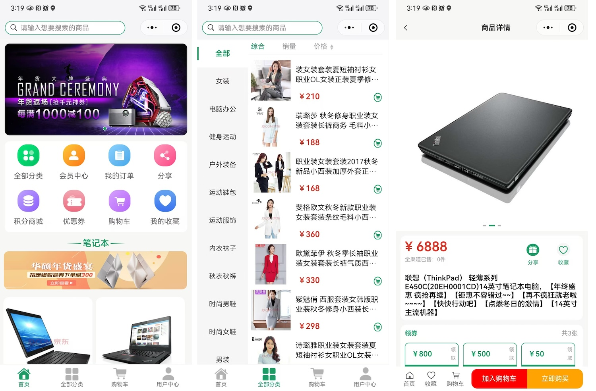
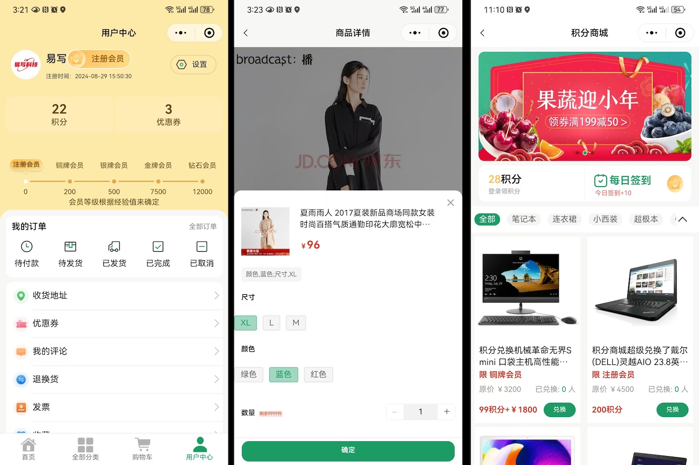
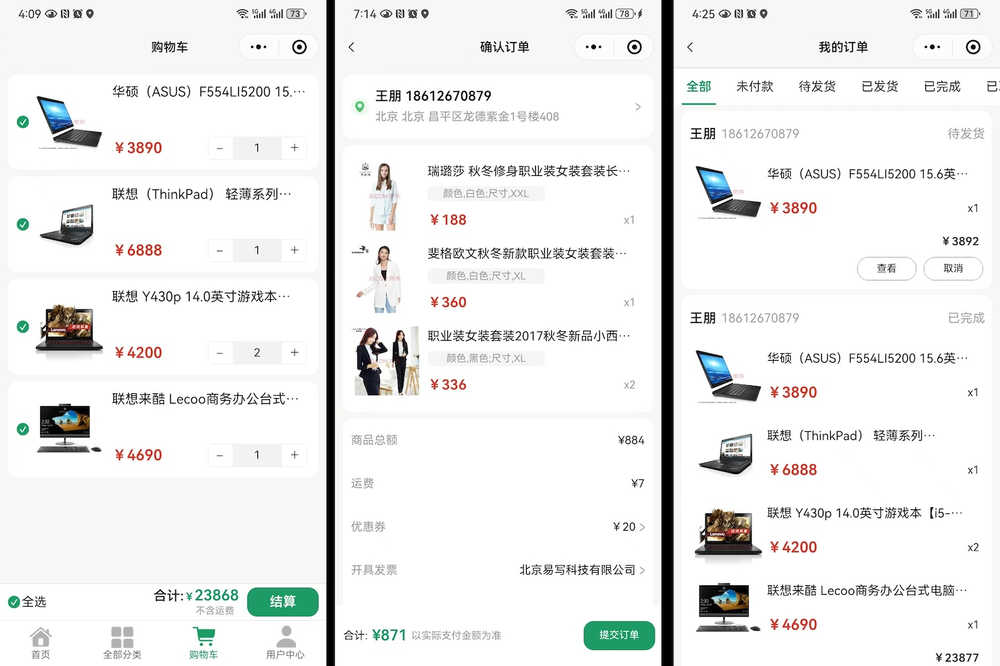
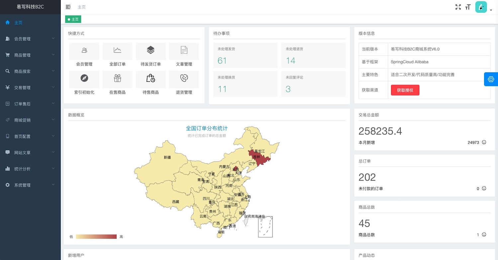
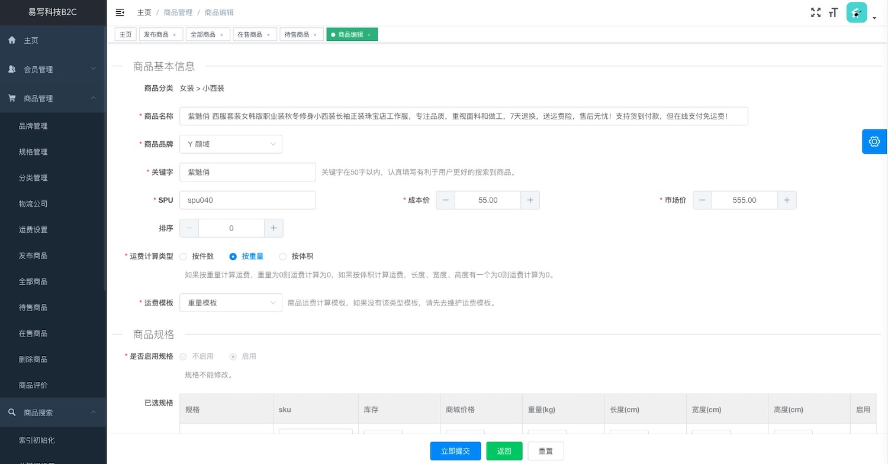
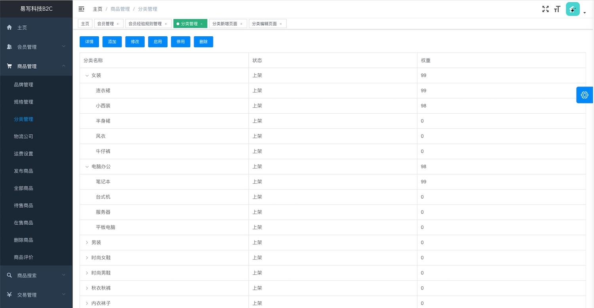
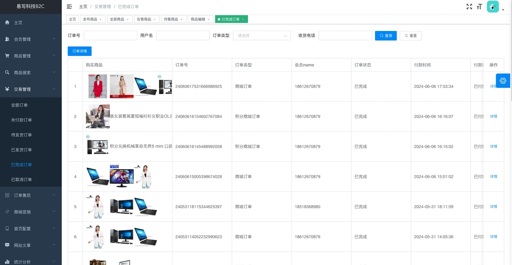
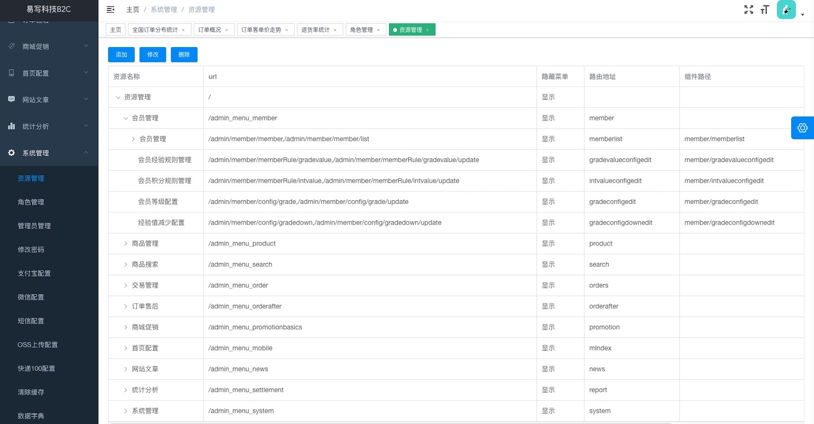
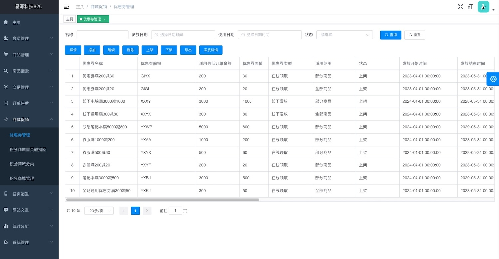
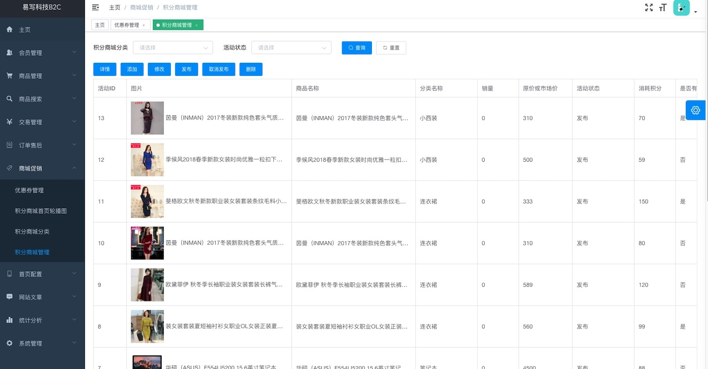

# 如果您觉得系统还不错，且确实能够对您的工作和学习起到帮助作用，在此诚挚地邀请您给予一个Star！！！

# 易写(云)科技java b2c开源微服务电商系统

# 此项目是商城系统的客户端源代码，采用uni-app进行开发

# 查看管理员Element源码 [查看](https://gitee.com/yixiekeji/b2cadmin)(<https://gitee.com/yixiekeji/b2cadmin>)

***

# 电商系统简介

易写(云)科技B2C单商家商城购物系统软件由易写科技自主开发而成，软件著作权号（2017SR126184），第一次推出时间在2016年3月1日，后期逐步迭代更新，为诸多客户提供优质的服务，具体可以查看易写科技官网：<http://www.yixiekeji.com/> 。

商城系统采用SpringCloud Alibaba + VUE + Uniapp开发，管理端采用ElementUI，用户端采用Uniapp开发，兼容小程序、H5、Android、IOS。

*   国内首套基于SpringCloud Alibaba微服务架构的开源电商系统；
*   国内首套真正从商务软件开源出来电商系统-有大量成功案例；
*   国内首套代码编写的核心成员均来自一线互联网电商公司；
*   国内首套无阉割开源微服务电商系统，gitee上可下载所有源代码；
*   阿里java开发规范，数据库每个表、每个字段都有注释，代码每个方法都有注释。

我们坚信开源的力量能够驱动创新，引领未来。我们提供开放、透明、可定制的商城源代码，让您轻松搭建属于自己的电商平台，掌握电商的未来。

***

# 我们的优势

## *🛠️*技术驱动，二次开发

开源商城采用SpringCloud Alibaba微服务架构，代码质量高，适合二次开发。同时，您可以根据自己的需求，自由调整商城的布局、功能、模块等，打造独具特色的电商网站。

## *🛒*丰富功能，满足需求

商城包含丰富的功能模块，如商品管理、订单处理、支付接口、会员系统、营销推广等，满足您在不同业务场景下的需求。同时，我们可以根据您的自身业务特点提供定制开发。

## *🔒*安全可靠，稳定运行

我们注重商城的安全性和稳定性，通过严格的代码审查、漏洞修复、安全加固等措施，确保商城的安全运行。同时，商业客户终身免费售后服务，全年7X24小时为您实时解答。

## *💡*持续创新，引领潮流

我们不断关注电商行业的最新动态和趋势，通过不断的技术创新和功能升级，让商城始终保持领先地位。同时，我们鼓励用户提出宝贵的意见和建议，共同推动商城的发展和创新。

## *🌐*成本效益，共创价值

个人免费，商业用途我们则需要收取很少的授权费用，以确保后续服务的专业性和持续性。同时，我们会对开源商城不断更新和维护，从而更好地满足市场需求和提升用户体验。

## *🌟*开源商城，无限可能

阿里java开发规范，数据库每个表、每个字段都有注释；代码每个方法，方法核心流程都有注释。同时，我们代码是100%开源，无任何封装，也没有对开源框架进行二次封装。

***

# 演示环境

## 管理端

<http://b2cadmin.yixiekeji.cn/>

用户名：admin 密码：123456

## 用户端

关注公众号，公众号上点击小程序，跳转到小程序演示环境，进行查看。

***

# 技术总述

|   B2C开源商城   |       个人用户       |                                           企业用户                                           |
| :---------: | :--------------: | :--------------------------------------------------------------------------------------: |
| Gitee是否全部功能 |         是        |                                             是                                            |
|  代码是否全部可下载  |         是        |                                             是                                            |
|     注册中心    |       Nacos      |                                           Nacos                                          |
|     服务熔断    |     Sentinel     |                                         Sentinel                                         |
|   REST服务调用  |     OpenFeign    |                                         OpenFeign                                        |
|     负载均衡    |      Ribbon      |                                          Ribbon                                          |
|      网关     |      Gateway     |                                          Gateway                                         |
|     数据库     |       Mysql      |                                           Mysql                                          |
|      缓存     |       Redis      |                                           Redis                                          |
|      搜索     |   Elasticsearch  |                                       Elasticsearch                                      |
|      前端     |      uniapp      |                                          uniapp                                          |
|    代码生成器    |         无        |                                           免费赠送                                           |
|   是否可以商业使用  | 否，仅限个人学习、研究、毕业设计 |                                            可以                                            |
|     售后服务    |         无        | 1、一对一实时解答 2、永久免费升级服务，第一时间获取最新版本 3、商城BUG终身修复 4、2天技术培训，一天技术一天业务 5、二次开发技术和业务免费咨询 6、一次免费安装部署 |
|      价格     |        免费        |                                           咨询客服                                           |

***

# uni-app端技术说明

uni-app的优势主要体现在以下几个方面：

## 跨平台开发能力

*   **多平台支持**：uni-app允许开发者使用一套代码，同时构建支持iOS、Android、H5、以及各种小程序（如微信、支付宝、百度、头条、QQ、钉钉等）的原生级别应用程序。这大大减少了开发者为不同平台单独开发的工作量，降低了开发成本和周期。
*   **统一的开发体验**：uni-app基于Vue.js框架，保留了Vue.js的大部分语法和特性，如组件、指令、计算属性、生命周期等。对于熟悉Vue.js的开发者来说，上手非常容易，无需学习新的框架或语法。

## 高效的开发效率

*   **丰富的组件和API**：uni-app提供了丰富的组件库和API，涵盖了设备信息、网络、存储、位置、媒体、界面交互等多个方面。这些组件和API的提供，使得开发者能够快速地构建出功能丰富、性能优越的应用程序。
*   **条件编译**：uni-app支持条件编译，允许开发者根据不同平台或条件来编写特定代码，实现平台差异性逻辑。这进一步提升了开发的灵活性和效率。

## 优秀的性能和稳定性

*   **优化渲染机制**：uni-app采用了优化的渲染机制和原生渲染，保证了应用的性能和流畅度。
*   **内存管理**：uni-app在内存管理方面也做了大量优化，确保了应用的稳定性。

## 丰富的生态和社区支持

*   **活跃的插件市场**：uni-app拥有一个活跃的插件市场，开发者可以方便地使用社区提供的插件，包括UI组件、工具函数、第三方SDK集成等。这些插件的提供，极大地提升了开发效率。
*   **丰富的教程和文档**：uni-app提供了丰富的教程和文档，帮助开发者快速上手和解决各种问题。
*   **强大的社区支持**：uni-app拥有庞大的开发者社区，开发者可以在社区中分享经验、交流心得，共同解决问题。

## 热更新和快速迭代能力

*   **热更新**：uni-app支持热更新，当应用发布后，可以在不重新提交应用到应用商店的情况下更新部分内容。这提升了应用的灵活性和用户体验。
*   **快速迭代**：由于uni-app支持跨平台开发，且拥有高效的开发效率和丰富的组件库，因此开发者能够快速地进行迭代和更新，满足不断变化的市场需求。

综上所述，uni-app在跨平台开发能力、高效的开发效率、优秀的性能和稳定性、丰富的生态和社区支持以及热更新和快速迭代能力等方面都表现出色。这些优势使得uni-app成为跨平台开发框架中的重要选择之一。

***

# 项目UI界面

## 用户端界面

## 管理端界面

***

# 后台主要功能

会员管理：会员管理、会员经验值规则配置、会员积分规则配置、会员等级配置、会员经验值配置等

商品管理：品牌管理、规格管理、分类管理、物流公司、运维设置、发布商品、商品管理、商品评价等

商品搜索：索引初始化、关键词设置、敏感词过滤设置、敏感词管理、搜索词历史记录

交易管理：全部订单、未付款订单、待发货订单、已发货订单、已完成订单、已取消订单

订单售后：退货管理、换货管理

商城促销：优惠券管理、积分商城轮播图、积分商城分类、积分商城商品管理

首页配置：首页轮播图、首页楼层、楼层数据

网站文章：文章分类、文章管理

统计分析：每日订单统计、每日商品统计、订单概况、订单客单价走势、退货率统计、全国订单分布统计、会员增长走势等

系统管理：资源管理、角色管理、管理员管理、修改密码、支付宝配置、微信配置、短信配置、OSS上传配置、快递100配置、清除缓存、数据字典

***

# 用户端主要功能

登录注册：微信联合登录注册、手机号验证码登录注册、手机号密码登录、手机号密码验证码注册、重置密码、退出登录

购物流程：首页、分类页面、商品单品页、购物车、提交订单、订单支付（支付宝、微信支付）

支付宝支付：H5支付、Android原生支付、IOS原生支付

微信支付：小程序支付、H5支付、Android原生支付、IOS原生支付

积分商城：积分商城首页、积分商城列表页、积分商城单品页、积分商城购物车、积分商城提交订单页面

积分商城支付：全部采用积分支付、积分+支付方式（支付宝或微信）支付

我的订单：待付款、待发货、已发货、已完成、已取消、全部订单

用户中心：收货地址、我的评论、退货、换货、发票、个人资料、联系我们、积分日志、经验值日志、我的等级

我的收藏：商品收藏、店铺收藏

优惠券：未使用、已经使用、已过期、查看优惠券适用商品

***

# 部署步骤

详细的部署步骤看 <http://www.yixiekeji.com/>

# 售后服务

## 企业

1.  一对一实时解答；
2.  永久免费升级服务，第一时间获取最新版本；
3.  商城BUG终身修复；
4.  2天技术培训，一天技术一天业务；
5.  二次开发技术和业务免费咨询；
6.  一次免费安装部署。

## 个人

**因为公司运营成本，暂时不针对个人有任何售后服务，您有疑问可以在我们官网查看在线文档，敬请谅解。**

## 联系方式

**只是针对企业用户，获取授权可添加微信、QQ或者电话联系**

售前：18612670879 QQ：43006111

微信：18612670879

**扫描下面二维码添加微信：无商业合作，暂不接受个人添加微信，敬请谅解。**

***

# 版权声明以及授权

易写(云)科技B2C单商家商城购物系统软件，软件著作权登记号：2017SR126184 。

版权所有：北京易写科技有限公司；官方网站: <http://www.yixiekeji.com/>

版权和所有权声明： 本公司对该软件产品拥有全部知识产权（包括但不限于专利权、著作权、商业秘密等），均受到相关法律法规的保护。 未获商业授权前，禁止本软件用于商业用途或者上传到开源网站。 未获商业授权前，禁止在本软件整体或部分基础上进行二次开发的衍生品用于商业用途或者上传到开源网站。 违者必究！！！

个人免费，商业用途我们则需要收取很少的授权费用，以确保后续服务的专业性和持续性。同时，我们会对开源商城不断更新和维护，从而更好地满足市场需求和提升用户体验。

获取商业授权查看易写科技官网：<http://www.yixiekeji.com/>

***

# 公司介绍

北京易写(云)科技有限公司是国内最专注的电商服务的软件公司，公司位于北京市，是一家拥有自主知识产权的高新科技公司，并相聚获得中关村高新、国家高新认证。

核心成员均来自一线互联网电商公司，有阿里、京东等工作经历，对互联网、电子商务有深刻理解，有着丰富的电商运营经验，具有大型电商平台架构和技术开发经验。

北京易写(云)科技有限公司旗下B2B2C、B2C、B2B、O2O拥有自主的知识产权。公司定位中高端电子商务提供商、适合二次开发的电子商务系统。

旗下采用Java作为开发语言，结合团队在阿里、京东、海尔电商的实际开发经验，不断开发完善，产品从丰富产品功能、提升用户体验、优化系统性能等方法入手，经过多次升级改版，多次为大型集团公司定制开发，我们的客户有国家电网、中信集团、中电普华、国电通、自然堂、姿美堂、喝茶客、乐视商城、报喜鸟、品悦阳光等，优质的服务得到客户的一致好评。

除此之外，**我们还提供区块链溯源、在线教育、知识服务等各种类软件的开发服务**，有需求随时联系我们。

官网：<http://www.yixiekeji.com/>
